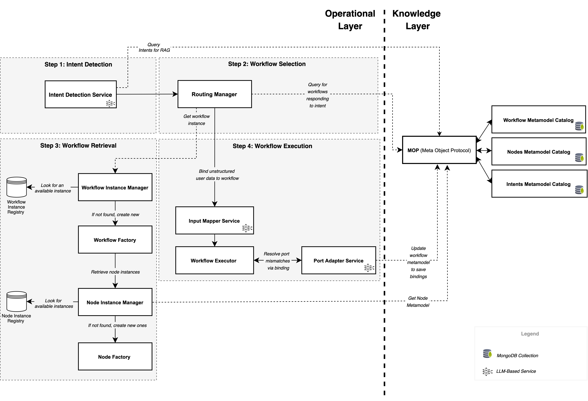

# Designing Self-Aware Multi-Agent AI Systems: A Two-Fold Framework Based on AIBOM and Reflective Architecture

> 📦 The Cognitive Workflow Framework is actively maintained at the repository: [github.com/ncaselli/cognitive-workflow](https://github.com/NiccoloCase/cognitive-workflow)

**Candidate**: Niccolò Caselli  
**Supervisor**: Prof. Enrico Vicario  
**Co-supervisor**: Marco Becattini  
**Institution**: Università degli Studi di Firenze  
**Department**: School of Engineering – Department of Information Engineering  
**Degree Program**: Bachelor’s Degree in Computer Engineering  
**Academic Year**: 2024/2025

---

📄 Download the full thesis manuscript: [`thesis/document.pdf`](./thesis/document.pdf)

---

## Abstract

The increasing complexity of modern AI systems—especially those based on large language models (LLMs) and multi-agent architectures—demands new methodologies to ensure system-level reliability, traceability, and adaptability. Existing tools offer limited visibility into software and knowledge dependencies, leaving a gap in accountable and maintainable cognitive workflows. This thesis addresses that gap by proposing a two-fold framework combining the Reflection architectural pattern with an extended notion of the Software Bill of Materials (SBOM), adapted for AI systems as the Artificial Intelligence Bill of Materials (AIBOM). This novel integration—largely unexplored in current literature—enables runtime adaptability and structured traceability. The architecture features a knowledge layer managing workflow meta-models and an operational layer for task execution. Reflection supports semantic interoperability across heterogeneous components whose interactions are not predefined. A use case in AI for Network Engineering (AI4NE) and Network Engineering for AI (NE4AI) demonstrates how cognitive workflows dynamically route requests across cloud resources based on evolving constraints (e.g., latency, energy efficiency, and computational cost). This work opens several research directions and lays the groundwork for further investigation into structured multi-agent architectures and their alignment with forthcoming AI governance regulations.

---

## Repository Structure

```
├── source/                    # Java source code of the implemented system
├── thesis/                    # LaTeX source files of the academic thesis
├── supplementary-materials/  # Tools, results, and images used in the experimentation
│   ├── langchain-vs-springai/ # Materials for the comparison in Appendix B
│   └── images/                # Diagrams and figures from the thesis
```

The `supplementary-materials` folder contains both the tools and the results used for the experimentation phase. In particular, it includes the materials used in **Appendix B** of the thesis, which compares **LangChain** and **Spring AI**, as well as all the **images and diagrams** used in the document.

---

## Project Overview

The project implements a reflective and self-aware AI system prototype based on:

* **Reflection Architectural Pattern**: for dynamic, runtime adaptability.
* **AI Bill of Materials (AIBOM)**: to ensure structured, transparent documentation of AI components.

This dual-layer architecture, derived from SALLMA, includes:

* **Knowledge Layer**: Meta-models for AI workflows and agent configurations.
* **Operational Layer**: Real-time execution and orchestration of cognitive workflows.

The solution aligns with emerging AI governance standards, supporting explainability, interoperability, and component reuse.

---

## Key Features

* **Dynamic Workflow Execution**: DAG-based workflows with reusable components.
* **Meta-Model-Driven Architecture**: Modularity and configurability via meta-catalogs.
* **Semantic Port System**: Input/output port abstraction and validation.
* **LLM Integration**:

  * Intent Detection
  * Input Variable Mapping
  * Port Schema Matching
* **AIBOM Management**: Structured recording of AI artifacts and workflow dependencies.
* **Runtime Self-Adaptation**: On-the-fly updates to workflows and agents.
* **Hybrid Search**: Supports retrieval of relevant meta-models.
* **Spring AI Integration**: Leverages modern Java-based AI tooling.

---

## Architecture Summary

### Knowledge Layer

* Stores and versions workflow, node, and intent meta-models.
* Enforced access via Meta-Object Protocol (MOP).
* Supports Hybrid Search and semantic querying.

### Operational Layer

* Instantiates and executes workflows using real-time context.
* Responds to meta-model updates and logs runtime events.
* Enables port adaptation and automatic workflow generation.

## Workflow Execution

This framework includes a custom-built workflow engine designed specifically for dynamic AI workflows. 
The execution process flows through four main steps:

1. **Intent Detection**  
   The **Intent Detection Service** analyzes the user's natural language request. It either retrieves a matching intent or creates a new one with relevant metadata.

2. **Workflow Selection**  
   The **Routing Manager** queries the Knowledge Layer to find workflows associated with the detected intent. If multiple workflows are available, it applies scoring or diversity techniques (like temperature sampling) to select the most appropriate one.

3. **Workflow Retrieval**  
   The **Workflow Instance Manager** loads an existing workflow or builds a new instance by querying the Knowledge Layer in real time.

4. **Workflow Execution**  
   The **Input Mapper Service** maps user inputs to workflow entry ports. The **Workflow Executor** then orchestrates the execution, dynamically resolving mismatches using the **Port Adapter Service**.



*Workflow execution process involving Intent Detection, Workflow Selection, Retrieval, and Port-Aware Execution.*


### Ports Adaptation

Components (nodes) in a workflow are often created independently, making their inputs and outputs potentially incompatible. To resolve this, the **Port Adapter Service** uses LLM-based inference to automatically match and adapt incompatible ports during execution.

When the **Workflow Executor** detects that a node cannot be executed due to missing or mismatched inputs, it invokes the Port Adapter. If a valid adaptation is found, the workflow is patched at runtime and updated in the Knowledge Layer for future reuse, avoiding redundant adaptation.

This process improves the system's **resilience** to breaking changes. For example, if a node is updated and its interface changes, the system may auto-correct the workflow without human intervention.


### Workflow Synthesis

When no existing workflow can satisfy a user’s intent, the system can **synthesize a new workflow from scratch** using metadata stored in the Knowledge Layer. This metadata is similar in spirit to SBOM (Software Bill of Materials) and AIBOM (AI Bill of Materials) and includes:
- Functional descriptions
- Latency/certification constraints
- Structured + unstructured metadata

These properties are embedded into a **Hybrid Search** index that enables the system to:
- Retrieve compatible components via semantic + keyword search
- Compose them dynamically into a valid workflow

This mechanism enables the system to respond to **previously unseen requirements**, including:
- Real-time latency or compliance constraints
- Missing workflows due to newly defined user intents

Once synthesized, workflows can be:
- Saved for future use
- Evaluated by AI or human reviewers
- Voted on by multiple agents using consensus (i.e., accepted only if generated by a majority)

This approach highlights the flexibility and autonomy of the system while acknowledging that **formal workflow synthesis remains an open research problem** and a key area for future development.

---


## Technologies

* Java (Spring Boot, Spring AI)
* MongoDB Atlas (NoSQL + Vector Search)
* OpenAI & Anthropic APIs
* WireMock (for integration test mocking)


---

## How to Run


### Environment Variables Setup
Before running the application, configure the following environment variables:

```bash
# OpenAI API Configuration
OPENAI_API_KEY=your_openai_api_key_here

# Anthropic API Configuration  
ANTHROPIC_API_KEY=your_anthropic_api_key_here

# MongoDB Configuration
MONGO_URI=your_mongodb_connection_string
MONGO_TEST_URI=your_test_mongodb_connection_string
MONGO_VECTOR_SEARCH_DEMO_URI=your_vector_search_mongodb_connection_string
```

### Running the Application

1. **Clone the repository**
   ```bash
   git clone <repository-url>
   cd <project-directory>
   ```

2. **Set up environment variables**

3. **Configure MongoDB Atlas**
   - **Required Search Indexes**: The project requires the following search indexes for semantic and hybrid search functionality:
     
     | Collection | Index Name | Type |
     |------------|------------|------|
     | `intents` | `intent_vector_index` | vectorSearch |
     | `meta_nodes` | `node_search_index` | search |
     | `meta_nodes` | `node_vector_index` | vectorSearch |
     
     These indexes must be created and in READY status before running the application.

4. **Launch the application**

     ```bash
     mvn spring-boot:run
     ```


---

## Testing Summary

* **104 tests total**:

  * **48 Unit Tests**: Model validation, port logic.
  * **54 Integration Tests**: LLM calls, schema conversion, DB access.
  * **2 End-to-End Tests**: RAG workflows and adaptations.
* Includes real LLM API calls for schema and intent validation.

---

## Case Study: AI4NE / NE4AI

A practical demonstration shows cognitive workflow routing of AI tasks based on:

* User intent analysis
* Network and hardware constraints
* Real-time model selection from AIBOM
* Regulatory and security checks

Demonstrated benefits:

* Increased traceability and transparency
* Runtime fault tolerance and adaptability
* Compliance with AI governance mandates

---

## Future Work

* Deploy as distributed SALLMA architecture
* Improve AI-driven workflow synthesis and evaluation
* Add security layers: blockchain, ZK proofs, verifiable credentials
* Expand to new domains via domain-specific ontologies and AIBOM schemas
* Research on quantitative evaluations and knowledge subtraction scenarios.

---


## Authors

* Niccolò Caselli (Università degli Studi di Firenze)

## Supervisors

* Prof. Enrico Vicario
* Marco Becattini


